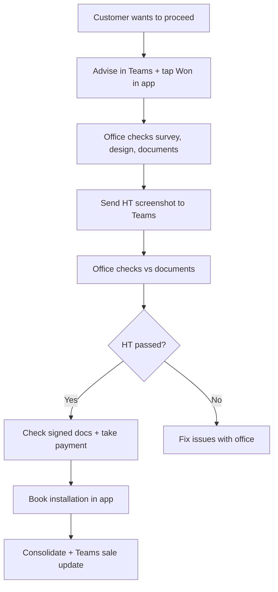

When a customer wants to proceed on **Hometree (HT)**, follow this process. It reduces errors on HT documents and avoids re-checking everything after HT approval.

This works **alongside** the app steps in [Step-by-step guide](/sales/step-by-step) — especially **Hometree**, **Contract Generation**, **Contract Signing**, and **Won**.

## Overview

## Step-by-step

### 1. Advise in Teams and tap Won in the app

When the customer confirms they want to proceed on HT:

- Post in your **Teams** channel that you are doing HT
- On **Solar Progress**, tap **Won** in the header (or mark **Won** when you finish — follow your team lead's timing)

This tells the office to start checking your job.

### 2. Office checks documents

The office will check:

- Survey  
- Design (OpenSolar)  
- Documents generated in the app  

Wait for their go-ahead before assuming HT is approved.

### 3. Send HT application screenshot

In Hometree, screenshot the application showing these boxes filled in:

- **Panel**  
- **Inverter**  
- **Battery**  
- **Generation**  

Send the screenshot in **Teams**.

### 4. Office matches and approves

The office compares your screenshot to the contract and survey. When it matches, they approve you to **continue with HT** in Hometree.

### 5. If passed on HT

Once HT is passed:

- Office checks all documents are signed in the app  
- You **take payment** (£500 holding via Lopay, then **Mark Payment Complete** in the app)

### 6. Book installation

In the app:

- **Book Installation** — installer, date (2+ weeks out), **09:00** slot  
- See [Step-by-step guide — Book installation](/sales/step-by-step#13-book-installation)

### 7. Consolidate

Complete any remaining consolidation steps your team requires (welcome email, final checks).

### 8. Send sale update in Teams

Post the sale update in **Teams** so everyone knows the job is complete.

## Contract before Hometree

Generate and sign the **EPVS contract in the app first**. Use those details to fill the Hometree application — do not complete HT before the contract information is ready.

Order in the app:

1. **Solar Projection**  
2. **Hometree** (open HT — step marks complete)  
3. **Contract Generation** → sign contract  
4. Fill HT using contract details  
5. Continue payment and installation steps  

## If something does not match

Stop and message the office in Teams. Do not submit HT or mark later steps complete until survey, design, contract, and HT application all align.
